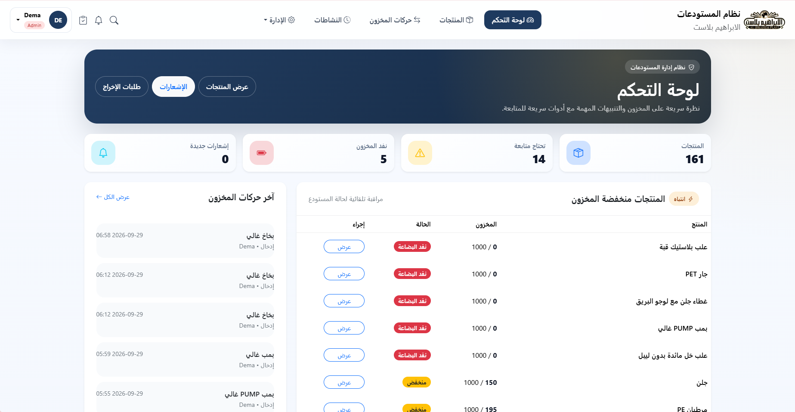
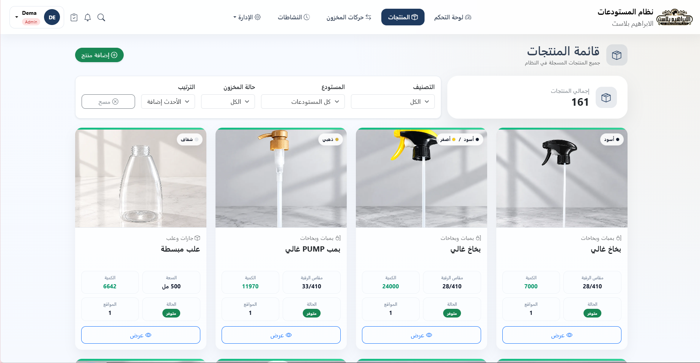
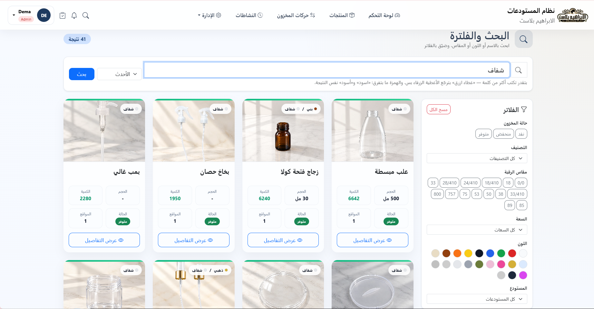
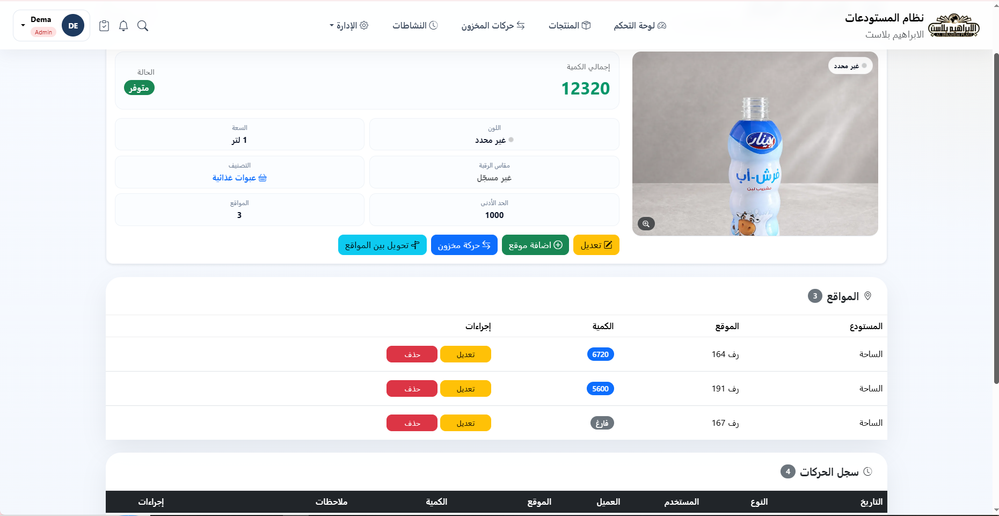

# Warehouse Management System

An inventory system built for **Al-Ibrahim Plast**, a plastic and glass
packaging supplier in Nablus, Palestine. It is in daily production use by the
team, tracking 160+ products across eight warehouses.

I work at the company, first in accounting. Tracking stock on spreadsheets kept
producing the same problems — a product counted twice, a shelf nobody could
find, a number that no longer matched the shelf. I built this to replace that.

**Stack:** Python · Flask · PostgreSQL · SQLAlchemy · Docker · Cloudflare R2

---

## What it does

- **Inventory across warehouses** — every product sits in one or more shelf
  locations, each with its own count. Stock moves in, out, or between them,
  and every movement is recorded and reversible.
- **Arabic-first search** — the whole interface is Arabic and right-to-left.
  Search handles the spelling variation that Arabic text actually has.
- **Roles** — admin, store manager and staff see and can do different things.
- **Low-stock alerts** — a product below its minimum raises a notification.
- **Stock requests** — staff request stock, a manager approves, and approval
  performs the movement.
- **Nightly backups** — the database is archived and shipped to object storage.

---

## Screenshots


| Dashboard | Products |
|---|---|
|  |  |

| Search and filters | Product detail |
|---|---|
|  |  |

---

## Problems worth describing

These are the parts that took thought rather than typing.

### Arabic search that does not depend on spelling

Arabic words are commonly written more than one way: **أسود** and **اسود** are
the same word, and so are **علبة** and **علبه**. Whoever is at the counter types
whichever their keyboard gives them. The original search compared the query
against each column with `ILIKE`, so a hamza in the wrong place meant no
results — searching **احمر** returned five products and **أحمر** returned none.

Two changes fixed it:

- Every product gets one `search_text` column holding its name, colours and
  measurements with the spelling folded (أ/إ/آ→ا, ة→ه, ى→ي). The query is folded
  the same way, so the spelling is settled before anything is compared.
- That column carries a **pg_trgm GIN index**, because `ILIKE '%…%'` cannot use
  a B-tree index at all — Postgres reads every row. Fine at a hundred products,
  not at several thousand.

Multi-word queries narrow rather than widen: *غطاء ازرق* returns only blue caps,
even though "غطاء" is the product name and "ازرق" lives on the colour table.

### Shelf references are parsed, not matched as words

Locations are written `رف 199 خانة 2` — shelf 199, slot 2. Matching that as four
separate words was wrong in a way that looked like a bug report: the digit `2`
matched a 250 مل bottle on the same shelf as readily as slot 2 did, so a slot
holding one product returned two.

A shelf reference is now read as a structure — shelf number plus a set of slots
— and compared against locations the same way. `رف 199 خانة 1-2-3` is one pile
across three slots, and a query for slot 2 matches it while a query for slot 5
does not.

### Images: 244 MB to 2.9 MB

Product photos were uploaded straight from phones and served from the
application. The product list was moving **32 MB per page load**.

Uploads are now re-encoded to WebP at a bounded size, and storage moved behind a
swappable layer with a Cloudflare R2 implementation. Page weight fell to
**0.6 MB**, the image set from 244 MB to 2.9 MB, and no image request touches
the application server any more.

### Stock cannot go negative

Two people withdrawing from the same shelf at the same moment is a real
scenario with eight threads and a shared warehouse. Reading a quantity,
checking it and writing it back leaves a window between the check and the write.

Every path that moves stock takes a row lock (`SELECT … FOR UPDATE`) before
reading the quantity, and the database carries a
`CHECK (quantity >= 0)` constraint as a backstop for anything the application
misses.

### Object storage and the database have to agree

An image in the bucket with no product row is wasted space; a product row whose
image is gone is a broken page. Both used to happen: the upload ran before the
form was validated, and a replacement deleted the old file before the new row
was committed.

Uploads now happen after validation and are removed if the transaction fails,
and the old file is deleted only after the replacement is committed.

---

## Testing

273 tests with pytest, run against a real PostgreSQL database built by the same
migrations production uses — a SQLite stand-in would silently skip the indexes
and CHECK constraints that some of the behaviour depends on.

```bash
pytest
```

The suite refuses to run unless the database name ends in `_test`.

Covered: search and Arabic normalisation, shelf parsing, catalogue filters and
paging, role permissions, inventory movements, the image pipeline, and the
duplicate-product guard.

---

## Running it

Requires Python 3.14 and PostgreSQL 18.

```bash
python -m venv venv
venv\Scripts\activate
pip install -r requirements.txt

copy .env.example .env      # then fill it in
flask db upgrade
flask create-admin

python wsgi.py
```

The app serves on `http://localhost:5000` through waitress.

### Deployment

`docker-compose.yml` brings up PostgreSQL, the application and Caddy, which
obtains and renews the HTTPS certificate itself.

```bash
docker compose up -d --build
```

Full walkthrough in [DEPLOY.md](DEPLOY.md).

---

## Design notes

**One process, many threads.** Restore mode is held in a module-level variable,
so several worker processes would leave only one of them aware that a restore is
running while the others kept serving and writing. waitress runs one process
with threads, which share that memory.

**Storage is swappable.** `utils/storage.py` defines the interface and two
implementations — local disk and R2 — selected by an environment variable. The
application never knows which one it is using, which is what made moving 244 MB
of images a configuration change rather than a rewrite.

**Categories are matched whole, not partially.** Product words match as
substrings, but a category name has to match completely. Otherwise "جار" — a
jar — returns every product filed under "جارات وعلب", which was sixty-four
results for a word eleven products actually carried.

---

## Layout

```
app.py              application setup, error handlers
models.py           SQLAlchemy models
routes/             one module per area, registered onto the app
utils/              search, images, storage, categorisation, backups
templates/          Jinja2, Arabic RTL, Bootstrap 5
migrations/         Alembic
tests/              pytest
scripts/            one-off and scheduled maintenance
```
